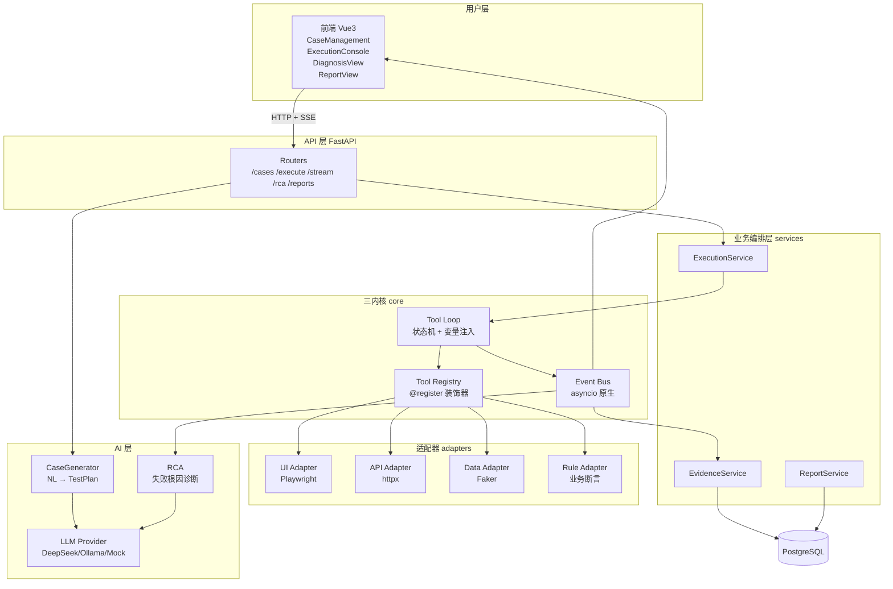

# AI 智能测试一体化平台

> 面向单个测试工程师的 AI 驱动一体化测试平台——自然语言生成结构化用例，三内核执行框架驱动 UI/API/数据/规则混合编排，失败自动 AI 根因诊断。

---

## 架构



---

## 快速启动

### 方式一：Docker Compose（推荐，一键启动所有服务）

```bash
# 克隆仓库
git clone <your-repo-url>
cd AI智能测试一体化平台

# 配置环境变量（mock 模式无需填 key）
cp .env.example .env

# 一键启动 PostgreSQL + Redis + Backend + Frontend
docker compose up --build

# 访问
# 前端 → http://localhost:5173
# 后端 API 文档 → http://localhost:8000/docs
```

### 方式二：本地开发

```bash
# 后端
cd backend
uv sync
cp ../.env.example .env   # 或用根目录的 .env
uv run uvicorn app.main:app --reload --port 8000

# 前端（另一个终端）
cd frontend
npm install
npm run dev                # http://localhost:5173
```

### 跑测试

```bash
cd backend
uv run pytest tests/ -v --cov=app --cov-report=html
```

---

## 技术栈

| 层 | 技术 | 自研/复用 |
|---|---|---|
| 后端 | Python 3.12 + FastAPI | 自研业务逻辑 |
| 执行内核 | Tool Registry + Tool Loop + Event Bus | ⭐ **自研三内核** |
| 适配器 | Playwright / httpx / Faker | 复用 |
| AI | Pydantic Schema 约束 + Prompt 模板 | ⭐ **自研生成流程** |
| 数据库 | PostgreSQL + SQLAlchemy 2.0 async | 复用 |
| 缓存 | Redis | 复用 |
| 前端 | Vue 3 + TypeScript + Element Plus + TailwindCSS | 自研页面 |
| 实时推送 | SSE（Event Bus 驱动） | ⭐ **自研推送** |
| 代码规范 | Ruff + mypy + pre-commit | 复用 |
| 部署 | Docker Compose | 复用 |
| CI | GitHub Actions | 复用 |

---

## 自研 vs 复用分界

| 必须自研（项目核心） | 直接复用 |
|---|---|
| Tool Registry（@register 装饰器自动发现工具） | Playwright（浏览器自动化） |
| Tool Loop 状态机（协议无关执行循环） | httpx（HTTP 客户端） |
| Event Bus（asyncio 原生事件总线） | SQLAlchemy 2.0 async（ORM） |
| 语义定位压缩策略（snapshot → LLM → locator） | Pydantic V2（数据校验） |
| 混合编排变量注入（{{step.field}}） | Faker（造数） |
| RCA 人机协同流程（诊断+证据+人工确认） | Element Plus + ECharts（UI 组件） |
| Schema 约束用例生成（严格 JSON 输出） | Ruff（代码规范） |
| SSE 实时执行事件推送 | Docker Compose（部署） |

> **不引入 LangChain / LlamaIndex / 任何 Agent 框架**——一个 while 循环能讲清的事，引框架只会让调试和面试讲解都变复杂。

---

## Non-Goals（明确不做）

- ❌ 压测 / 性能测试
- ❌ 安全测试 / 漏洞扫描
- ❌ 移动端测试（iOS / Android App）
- ❌ K8s 编排 / 分布式部署
- ❌ 多租户 / SaaS 化
- ❌ 历史项目迁移 / TestHub 导入

---

## 目录结构

```
AI智能测试一体化平台/
├── backend/           # FastAPI 后端
│   ├── app/
│   │   ├── core/      # ⭐ 三内核
│   │   ├── adapters/  # 适配器层（UI/API/数据/规则）
│   │   ├── ai/        # AI 模块（Provider + CaseGenerator + RCA）
│   │   ├── models/    # Pydantic V2 数据模型
│   │   ├── database/  # SQLAlchemy async + Alembic
│   │   ├── routers/   # FastAPI 路由
│   │   ├── services/  # 业务编排
│   │   └── utils/     # 工具函数
│   └── tests/         # pytest 单测 + 集成测试
├── frontend/          # Vue 3 前端
├── assets/            # Demo 素材 + Phase 完成证据
├── AGENTS.md          # AI Agent 开发指令（铁律 + 阶段顺序）
├── SPEC.md            # 完整技术规格书（目录 + 数据模型 + 内核接口 + API 路由）
├── docker-compose.yml # 一键启动所有服务
├── .env.example       # 环境变量模板
└── LICENSE            # MIT
```

---

## 开发阶段

开发顺序严格按 `AGENTS.md` 和 `SPEC.md` 执行，不许跳 Phase：

```
Phase 0 环境骨架 → Phase 1 三内核 → Phase 2 适配器 → Phase 3 CLI 闭环
→ Phase 4 AI 用例生成 → Phase 5 RCA → Phase 6 FastAPI+前端 → Phase 7 测试+CI
```

---

## License

MIT License。详见 [LICENSE](./LICENSE)。
