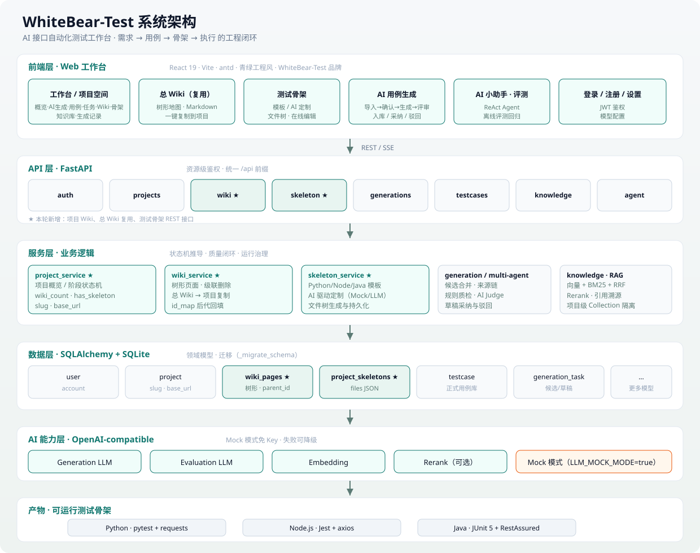
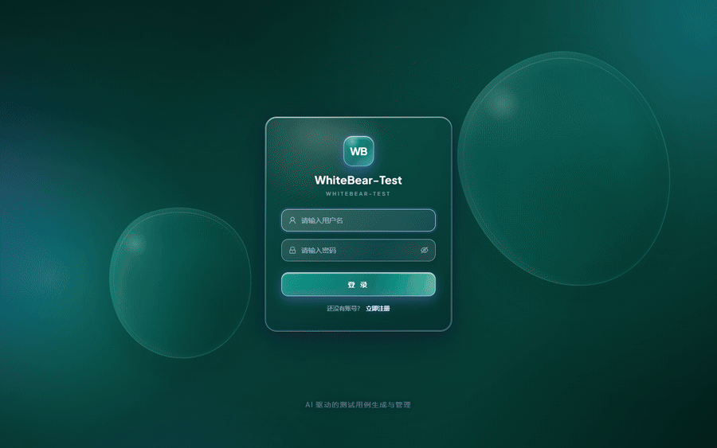

<div align="center">

# WhiteBear-Test

**AI 接口自动化测试工作台：从需求文档到可执行测试用例的完整工程闭环**

将需求结构化、RAG 知识增强、多 Agent 用例生成、质量评测、人工评审与测试执行串成一条可追溯、可恢复的生产链路；每个项目以「项目空间」组织，自带 Wiki 地图与可初始化的自动化测试骨架。


[核心能力](#核心能力) · [项目空间](#项目空间wiki-与测试骨架) · [技术架构](#技术架构) · [快速上手](#快速上手) · [目录说明](#目录说明)

</div>

---



## 为什么需要 WhiteBear-Test

测试团队日常面临三类高频痛点：PRD 到手后手工拆解用例耗时长；边界与异常场景靠经验，覆盖不均；业务知识散落在文档和聊天记录里，直接丢给大模型又容易脱离上下文。

WhiteBear-Test 的思路是把大模型嵌入一条有约束的生产链路，不让模型裸奔——从需求导入到用例入库，每一步都有结构化校验、规则质检和人工评审兜底。

```text
需求导入 → 功能点确认 → RAG 增强生成 → 规则质检 → AI 评分 → 人工评审 → 用例库 → 执行 → 复盘
```

## 功能演示

完整操作流程：登录 → 工作台 → 总 Wiki → 复制规范到项目 → 项目 Wiki → 生成测试骨架 → 查看工作台状态。

<video src="docs/assets/whitebear-demo.mp4" width="720" controls preload="metadata"></video>



## 核心能力

| 模块 | 说明 |
|---|---|
| 项目空间 | 以项目为单位隔离数据，承载概览、生成、用例、任务、Wiki、骨架、知识库 |
| Wiki 地图 | 每个项目独立树形 Wiki，支持 Markdown 编辑预览、级联增删改 |
| 总 Wiki 复用 | 工作台总 Wiki 沉淀通用规范，一键复制到任意项目 |
| 测试骨架 | 按语言（Python/Node.js/Java）生成可直接运行的接口测试骨架，支持模板和 AI 定制 |
| 需求解析 | 支持文本/Markdown/Word/FeatureList 导入，拆解为可编辑功能点 |
| 用例生成 | 完整覆盖与快速冒烟双策略，可叠加安全、接口等专项 Skill |
| 知识增强 | 项目级向量 + BM25 + RRF 混合检索，可选 Rerank 精排 |
| 质量管控 | 规则质检、重复检测、AI Judge、覆盖矩阵、人工评审 |
| AI 助手 | ReAct Agent 驱动的对话入口，可查询项目数据并触发生成流水线 |
| 运行治理 | 持久化 AgentRun、Worker 租约心跳、预算控制、取消重试 |
| 测试管理 | 用例库、脑图、测试任务/批次、执行结果、缺陷记录、导出 |
| 离线评测 | 固化样本与模型快照，回归对比生成质量 |

## 项目空间、Wiki 与测试骨架

除主链路外，平台把工程组织能力也内置进来：

```text
工作台（总 Wiki：跨项目复用规范）
   └── 项目空间
        ├── 概览 / AI 生成 / 用例 / 测试任务
        ├── 项目 Wiki（树形地图 + Markdown）
        ├── 测试骨架（Python / Node.js / Java）
        └── 知识库 / 生成记录
```

- **工作台**：项目卡片汇总 Wiki 页数与骨架状态，支持进入总 Wiki 或新建项目。
- **总 Wiki 复用**：通用规范沉淀在工作台总 Wiki，复制到项目即完成规范下发。
- **测试骨架**：为项目初始化可直接运行的文件树；AI 定制模式基于项目信息生成说明。
- Wiki 与骨架有独立 REST 接口和数据模型，与主链路共用鉴权与项目隔离。

## 技术架构

后端基于 FastAPI + SQLAlchemy，前端 React + Vite，AI 层用 LangGraph 编排工作流。几个关键设计决策：

**可恢复的工作流**：生成流程拆成状态节点，Graph State 只存 ID 和普通字典，数据库连接与模型客户端不进 checkpoint。失败可从最近检查点恢复，稳定生成键避免重复写草稿。→ [graph.py](backend/app/workflows/generation/graph.py) · [state.py](backend/app/workflows/generation/state.py)

**插件化 Skill**：每个 Skill = `skill.yaml` + Pydantic 模型 + Handler + Prompt。注册表自动发现，执行器统一做契约校验、超时、预算和事件记录，前端按 Catalog 动态渲染。→ [registry.py](backend/app/skills/registry.py) · [executor.py](backend/app/skills/executor.py)

**混合检索**：文档按 Markdown 标题路径分块，向量与 BM25 双路召回后 RRF 融合，配置 Rerank 时精排，失败降级。向量库按项目和模型隔离。→ [knowledge_service.py](backend/app/services/knowledge_service.py) · [retrievers.py](backend/app/ai/retrievers.py)

**持久化 Agent 运行时**：AgentRun 记录运行状态、预算和事件，独立 Worker 靠租约心跳领任务，支持取消、重试和过期恢复。多 Specialist 候选先落库再按规则合并。→ [agent_runtime/](backend/app/agent_runtime/) · [worker.py](backend/app/worker.py)

**质量闭环**：结构化输出 → 规则质检 → 重复检测 → AI Judge → 人工评审，只有采纳才生成正式用例。失败功能点可沉淀为评测样本。→ [quality_checker.py](backend/app/services/quality_checker.py) · [case_judge/](backend/app/skills/case_judge/)

## AI 测试助手

对话式入口，与生成向导共用同一套数据和内核：

```text
提问 / 上传需求 → ReAct 决策 → 项目级工具调用 → 写操作人工确认 → 断点恢复 → SSE 输出
```

- 查询工具绑定 `project_id`，模型不能跨项目取数。
- 确认功能点、启动生成、采纳/驳回等写操作走结构化确认卡片。
- Agent 创建的需求、任务、草稿与向导页面共用数据，不产生第二套。
- 长对话用消息窗口、滚动摘要和流程状态分层管理上下文。

源码：[runner.py](backend/app/agent/runner.py) · [tools.py](backend/app/agent/tools.py) · [memory.py](backend/app/agent/memory.py)

## 使用流程

1. **导入需求**：粘贴文本或上传 `.docx` / `.md`，也可导入 FeatureList。
2. **确认功能点**：编辑模块、功能点、验收标准、优先级，划定测试范围。
3. **选择策略**：完整覆盖或快速冒烟，叠加安全/接口专项，可选知识库。
4. **后台生成**：按功能点执行检索、核心生成、专项生成、合并、质检、评分。
5. **人工评审**：查看覆盖矩阵，编辑、采纳或驳回候选用例。
6. **入库执行**：采纳后生成正式用例，可导出 Excel/Markdown 或加入测试任务。
7. **评测复盘**：比较评测运行，分析召回、重复、幻觉、Token 与耗时。

## 快速上手

### 环境要求

- Python 3.12+
- Node.js 20.19+ 或 22.12+
- Windows、macOS 或 Linux

默认开启 Mock 模式：`LLM_API_KEY` 留空且 `LLM_MOCK_MODE=true` 时，无需模型 Key 即可体验完整流程。

> **体验账号**（Mock 模式内置）：`demo_admin` / `nini123456`。

### 克隆仓库

```bash
git clone https://github.com/WhiteBear-wpl/Anything-Need-Testwork.git
cd Anything-Need-Testwork
```

### Windows 一键启动

```powershell
.\setup.bat
.\start.bat
```

`start.bat` 会分别启动：

- 前端：<http://localhost:5173>
- 后端：<http://localhost:8000>
- API 文档：<http://localhost:8000/docs>
- Agent Worker：Runtime V2 的持久任务执行进程

使用 `.env` 中配置的管理员账号登录；开启注册时也可以创建普通账号。首次公开仓库前请务必修改管理员密码。

### macOS / Linux 手动启动

```bash
cp .env.example .env

cd backend
python -m venv venv
source venv/bin/activate
pip install -r requirements.txt
uvicorn app.main:app --reload --port 8000
```

另开终端启动 Worker：

```bash
cd backend
source venv/bin/activate
python -m app.worker
```

再启动前端：

```bash
cd web
npm install
npm run dev
```

### 接入真实模型

复制 `.env.example` 后，通过设置页或 `.env` 配置以下模型角色：

| 角色 | 配置项 | 用途 |
|---|---|---|
| Generation LLM | `LLM_BASE_URL` / `LLM_MODEL` / `LLM_API_KEY` | 需求解析、用例生成、测试助手 |
| Evaluation LLM | `EVAL_LLM_BASE_URL` / `EVAL_LLM_MODEL` / `EVAL_LLM_API_KEY` | AI Judge 与评测；留空时复用生成模型 |
| Embedding | `EMBEDDING_BASE_URL` / `EMBEDDING_MODEL` / `EMBEDDING_API_KEY` | 知识库向量化与语义检索 |
| Rerank | `RERANK_BASE_URL` / `RERANK_MODEL` / `RERANK_API_KEY` | 可选精排；未配置时使用 RRF 结果 |

模型接口采用 OpenAI-compatible 协议。不要提交包含真实密钥的 `.env`。

## 自动化测试

项目包含后端单元测试，以及独立的 API/UI 自动化工程。自动化环境使用临时 SQLite、临时 Chroma 和 Mock LLM，不污染本地开发数据。

```bash
cd autotest

./run_tests.sh api
./run_tests.sh ui
./run_tests.sh smoke
./run_tests.sh all
```

Windows 使用：

```powershell
cd autotest
./run_tests.bat api
./run_tests.bat ui
./run_tests.bat smoke
./run_tests.bat all
```

前端逻辑测试：

```bash
cd web
npm test
```

更多说明见 [自动化测试文档](autotest/README.md)。

## 目录说明

```text
Anything-Need-Testwork/
├── backend/
│   ├── app/
│   │   ├── api/              # 路由与鉴权（含 wiki / skeleton）
│   │   ├── models/           # 领域模型（含 wiki / skeleton）
│   │   ├── services/         # 业务服务与质量逻辑
│   │   ├── ai/               # 模型、Embedding、Chroma 适配
│   │   ├── skills/           # Skill 插件
│   │   ├── workflows/        # 生成工作流
│   │   ├── agent/            # 测试助手
│   │   └── agent_runtime/    # 运行治理
│   ├── benchmarks/           # RAG 与生成实验
│   └── tests/                # 后端测试
├── web/
│   ├── src/pages/            # 业务页面
│   ├── src/components/       # 通用组件
│   └── src/services/         # API 客户端
├── autotest/                 # API/UI 自动化工程
├── docs/                     # 文档与评测报告
└── openspec/                 # 变更规格
```

### 源码入口

1. [FastAPI 入口](backend/app/main.py)
2. [生成任务 API](backend/app/api/generations.py)
3. [生成工作流](backend/app/workflows/generation/graph.py)
4. [Skill 注册表](backend/app/skills/registry.py)
5. [混合检索](backend/app/services/knowledge_service.py)
6. [Agent Runtime](backend/app/agent_runtime/)
7. [前端生成向导](web/src/pages/GenerateFlow.jsx)

## 设计取舍

| 决策 | 考虑 |
|---|---|
| 草稿与正式用例分离 | AI 输出不绕过人工评审直接污染资产 |
| Graph State 只存可序列化数据 | Session、客户端、密钥不进 checkpoint |
| 业务库与 checkpoint 分离 | 恢复数据不与领域数据耦合 |
| Skill 运行时统一校验 | 避免各专项 Handler 协议不一致 |
| Specialist 候选先落库再合并 | 保留来源与去重链，便于审计 |
| RAG 失败允许降级 | 检索异常不阻断核心生成 |
| Mock 覆盖完整流程 | 降低本地体验和测试对外部模型的依赖 |

## 后续方向

当前面向本地和中小规模部署：SQLite + 单 Worker + 进程内会话。后续可演进：

- PostgreSQL + Redis/消息队列，支持多实例和多 Worker。
- 持久化会话与完整的组织、角色、权限模型。
- 人工编辑、驳回、线上缺陷自动沉淀为回归样本。
- 对接 Jira、禅道、TestRail 等外部系统。
- OpenTelemetry 链路追踪与成本看板。
- 稳定 CI 与可复现评测基线。

---

<div align="center">

欢迎通过 Issue 交流 AI 测试工程、Agent Runtime 与 RAG 评测实践。

</div>

