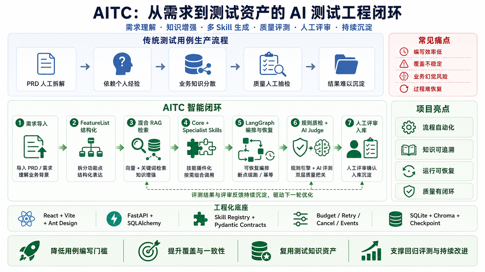
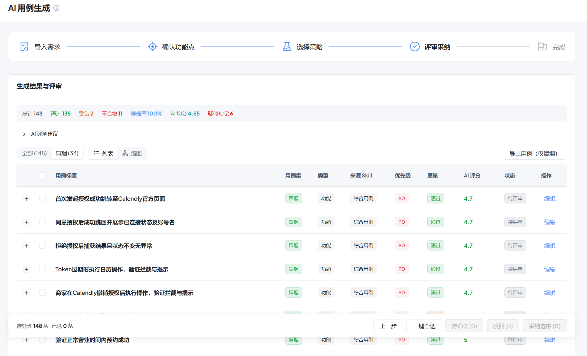
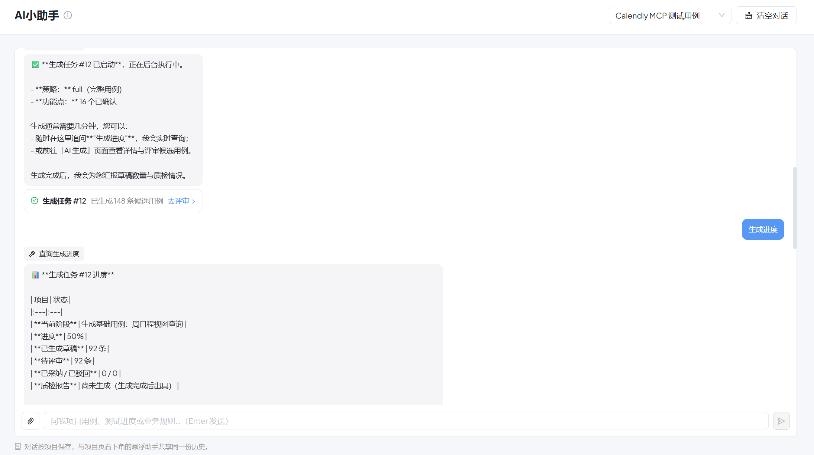

<div align="center">

# WhiteBear-Test

**AI 接口自动化测试工作台：从需求文档到可执行测试用例的完整工程闭环**

将需求结构化、RAG 知识增强、多 Agent 用例生成、质量评测、人工评审与测试执行串成一条可追溯、可恢复的生产链路；每个项目以「项目空间」组织，自带 Wiki 地图与可初始化的自动化测试骨架。


[面试官速览](#面试官速览) · [项目截图](#项目截图) · [技术亮点](#技术亮点) · [快速开始](#快速开始) · [代码导航](#代码导航)

</div>

---



## 面试官速览

> **项目定位：** WhiteBear-Test 是一个 AI 接口自动化测试工作台，以「项目空间」为核心组织测试资产，将需求理解、知识增强、多 Skill 生成、自动质检、人工评审、Wiki 沉淀与测试骨架初始化连接为可恢复、可追溯的工程闭环。

**技术栈：** Python · FastAPI · SQLAlchemy · SQLite · React · Vite · LangGraph · LangChain · Chroma · Pytest

1. **LangGraph 工作流与 Skill 插件编排**：将需求导入、FeatureList 确认、知识检索、核心/专项 Skill 生成、规则质检、AI Judge、人工评审和入库导出拆成可恢复的状态节点；通过 `skill.yaml + Handler + Prompt + Pydantic Schema` 约束 Skill 契约，使需求解析、核心用例、安全测试、接口测试和质量评测能力可以动态发现与独立演进。[生成工作流](backend/app/workflows/generation/) · [Skill Registry](backend/app/skills/registry.py)
2. **多角色用例生成与候选持久化**：以功能点为执行单元，协同核心用例、安全测试与接口测试三类产出，支持专项并发、候选归并、规则质检和核心生成失败重试；中间候选与来源链持久化保存，便于解释生成结果、定位失败阶段并追踪最终草稿来源。[多角色编排](backend/app/services/multi_agent_service.py) · [候选数据模型](backend/app/models/generation.py)
3. **项目级混合 RAG 与引用溯源**：将业务规则、接口文档和历史缺陷按 Markdown 标题路径与文本长度切片，使用向量检索、BM25、RRF 融合与可选 Rerank 召回 Top-K 知识；精排失败时降级到融合结果，并把引用来源随生成结果保存。[混合检索](backend/app/services/knowledge_service.py) · [Retriever 适配](backend/app/ai/retrievers.py)
4. **11 工具测试 Agent 与运行治理**：基于 LangGraph 自定义 ReAct 循环封装 6 个查询工具和 5 个生成流水线工具，通过 SSE 展示工具调用过程，并以 `interrupt + checkpoint` 控制写操作审批与断点恢复；统一 `AgentRun`、Worker 队列、租约心跳、预算、取消、重试和事件追踪，使生成与评测任务具备可观测、可治理的运行边界。[Agent Tools](backend/app/agent/tools.py) · [Agent Runtime](backend/app/agent_runtime/)

## 架构总览


## 功能演示

完整操作演示：登录 → 工作台 → 工作台总 Wiki → 复制规范页到项目（跨项目复用）→ 项目 Wiki → AI 测试骨架 → 回到工作台查看最新状态。

<video src="docs/assets/whitebear-demo.mp4" width="720" controls preload="metadata"></video>


## 项目截图

### AI 用例生成与评审

生成任务完成后统一展示规则质检、覆盖率、AI Judge 评分与疑似幻觉统计；测试人员可以筛选冒烟集，并对候选用例执行编辑、采纳或驳回。



### AI 测试助手

测试助手可以在对话中启动生成任务、查询实时进度，并将生成结果回流到同一套评审流程。



## 项目简介

WhiteBear-Test 面向测试工程师与测试负责人，解决三个典型问题：

- 从 PRD 到测试用例需要大量重复整理，交付周期长。
- 用例覆盖依赖个人经验，边界、异常和专项场景容易遗漏。
- 业务规则、历史缺陷和测试经验分散，直接使用 LLM 又容易脱离业务上下文。

项目把 LLM 放进一套有约束的测试生产流程，而不是直接把模型输出当作最终结果：

```text
需求导入 → FeatureList 确认 → RAG 增强生成 → 规则质检 → AI Judge
        → 人工评审 → 正式用例库 → 测试任务执行 → 评测与复盘
```

页面向导、AI 测试助手和离线评测共用同一套生成内核，所有产物都能回溯到需求功能点、生成任务、模型配置和知识引用。

## 核心能力

| 模块 | 能力 |
|---|---|
| 工作台 / 项目空间 | 以项目为单位的独立空间，统一承载概览、AI 生成、用例、任务、Wiki、测试骨架、知识库与生成记录 |
| 项目 Wiki | 每个项目独立的树形 Wiki 地图，Markdown 编写与实时预览，支持级联新建/重命名/删除 |
| 总 Wiki 复用 | 工作台总 Wiki 沉淀通用规范，页面（含全部子页）可一键复制到任意项目复用 |
| 测试骨架初始化 | 按语言生成可直接运行的接口测试骨架，支持静态模板与 AI 驱动定制，文件树浏览与在线编辑 |
| 需求结构化 | 支持文本、Markdown、Word 和 FeatureList 导入，将 PRD 拆解为可编辑、可选择的功能点 |
| 用例生成 | 完整覆盖与快速冒烟两种策略，支持安全、接口等专项 Skill 叠加 |
| 知识增强 | 项目级知识库，采用向量检索、BM25、RRF 与可选 Rerank 的混合召回链路 |
| 质量保障 | Prompt 约束、规则质检、重复检测、AI Judge、覆盖矩阵与人工评审 |
| AI 测试助手 | LangGraph ReAct Agent，支持查询项目数据和驱动用例生成流水线 |
| 运行治理 | 持久化 AgentRun、独立 Worker、租约心跳、取消重试、预算控制和事件追踪 |
| 测试管理 | 正式用例库、脑图视图、测试任务/批次、执行结果、缺陷记录与导出 |
| 离线评测 | 固化样本、模型与 Skill 快照，对生成质量、召回、重复和成本进行回归对比 |

## 项目空间、Wiki 与测试骨架

除「需求 → 用例 → 执行」的主链路外，WhiteBear-Test 将工程组织能力也内置进平台：

```text
工作台（总 Wiki：跨项目复用规范）
   └── 项目空间
        ├── 概览 / AI 生成 / 项目用例 / 测试任务
        ├── 项目 Wiki（树形地图 + Markdown，可复制总 Wiki 页面进来）
        ├── 测试骨架（Python / Node.js / Java，模板或 AI 定制）
        ├── 知识库 / 生成记录
```

- **工作台**：以项目卡片汇总每个空间的 Wiki 页数与骨架状态，一键进入总 Wiki 或新建项目。
- **总 Wiki 复用**：通用测试规范沉淀在工作台总 Wiki，复制到项目即完成团队规范下发，无需重复编写。
- **测试骨架**：为项目初始化一套可直接 `pytest / jest` 运行的文件树；「AI 驱动定制」会基于项目信息生成定制 README 与测试说明。
- 后端为 Wiki 与骨架提供完整 REST 接口与数据模型（`wiki_pages`、`project_skeletons`），与主链路同一套鉴权与项目隔离。

## 技术亮点

### 1. 可恢复的 LangGraph 生成工作流

**问题：** 多功能点生成包含检索、多个模型调用、校验和评分，任何一步失败都可能导致长任务整体重跑。

**实现：** 将生成流程拆成状态节点，只在 Graph State 中保存任务 ID、功能点 ID 和普通字典；数据库 Session、模型客户端和 API Key 不进入 checkpoint。任务失败后可从最近检查点恢复，并使用稳定生成键避免草稿重复写入。

**价值：** 长耗时 AI 工作流具备明确状态、阶段进度、失败恢复和幂等边界。

- [工作流拓扑](backend/app/workflows/generation/graph.py)
- [工作流状态](backend/app/workflows/generation/state.py)
- [执行与恢复](backend/app/workflows/generation/runner.py)
- [节点实现](backend/app/workflows/generation/nodes.py)

### 2. Manifest 驱动的 AI Skill 插件体系

**问题：** 如果每增加一种专项测试都要修改生成主流程和前端枚举，能力扩展会快速变成硬编码。

**实现：** 每个 Skill 由 `skill.yaml`、Pydantic 输入输出模型、异步 Handler 和 Prompt 组成。注册表自动发现本地 Skill，统一执行器负责契约校验、超时、取消、预算和事件记录；前端通过 Skill Catalog 动态渲染可选专项。

**价值：** 核心编排保持稳定，安全、接口等专项能力可以独立演进，并保留版本与 Prompt 指纹用于复现。

- [Skill Loader](backend/app/skills/loader.py)
- [Skill Registry](backend/app/skills/registry.py)
- [Skill Executor](backend/app/skills/executor.py)
- [Case Writer](backend/app/skills/case_writer/)
- [Security Specialist](backend/app/skills/security/)

### 3. 面向测试语料的混合 RAG

**问题：** 纯向量检索擅长语义相似，但容易漏掉错误码、字段名和业务专有词；纯关键词检索又难以覆盖语义表达差异。

**实现：** 文档按 Markdown 标题路径分块，向量与 BM25 各自召回候选，再通过 RRF 融合；配置外部 Rerank 时进行精排，调用失败则降级到融合结果。Collection 按项目、Embedding 端点和模型隔离，防止跨项目污染与向量维度冲突。

**价值：** 同时兼顾语义召回、精确词命中、检索降级和知识引用溯源。

- [知识入库与混合检索](backend/app/services/knowledge_service.py)
- [LangChain Retriever 适配](backend/app/ai/retrievers.py)
- [向量库隔离](backend/app/ai/vector_store_factory.py)
- [Embedding 适配](backend/app/ai/embedding_factory.py)

### 4. 持久化 Agent Runtime 与受控多 Agent

**问题：** 普通后台协程缺少可靠队列、取消、预算和审计机制；多个 Specialist 并发后还需要处理重复候选与来源追踪。

**实现：** Runtime V2 将运行记录、预算快照和事件持久化为 `AgentRun`；独立 Worker 通过租约和心跳领取任务，支持取消、重试和过期恢复。专项 Agent 设置并发上限，所有候选先追加保存，再按确定性规则合并并保留来源链。

**价值：** AI 任务从“黑盒后台调用”升级为可治理、可观测、可审计的执行单元。

- [Runtime Contracts](backend/app/agent_runtime/contracts.py)
- [Runtime Harness](backend/app/agent_runtime/harness.py)
- [Runtime Repository](backend/app/agent_runtime/repository.py)
- [Worker](backend/app/worker.py)
- [多 Agent 合并](backend/app/services/multi_agent_service.py)

### 5. AI 输出质量闭环

**问题：** 结构合法不代表用例可执行，单一自动评分也不能替代测试人员的业务判断。

**实现：** 生成链路依次执行结构化输出约束、规则质检、重复检测和 AI Judge；评审页提供列表与覆盖矩阵，只有人工采纳后才生成正式 `TestCase`。失败功能点可沉淀为评测候选，离线评测复用同一生成内核进行回归对比。

**价值：** 将模型生成、自动评估、人工决策和回归样本连接成可持续改进的闭环。

- [规则质检](backend/app/services/quality_checker.py)
- [AI Judge](backend/app/skills/case_judge/)
- [草稿采纳与驳回](backend/app/services/generation_service.py)
- [评测服务](backend/app/services/evaluation_service.py)

## AI 测试助手

测试助手不是独立的聊天 Demo，而是 WhiteBear-Test 的第二个业务入口：

```text
用户问题 / 需求附件
    → ReAct 模型决策
    → 项目级工具查询或生成操作
    → 写操作进入 interrupt 人工确认
    → checkpoint 恢复执行
    → SSE 返回工具过程、Token 与最终回答
```

- 查询工具在创建时绑定 `project_id`，模型不能跨项目取数。
- 确认功能点、启动生成、采纳/驳回等写操作必须经过结构化确认卡片。
- Agent 创建的需求、任务、草稿与向导页面完全共用，不产生第二套数据。
- 长对话采用消息窗口、滚动摘要和结构化流程状态分层管理上下文。

源码入口：[Agent Runner](backend/app/agent/runner.py) · [Agent Tools](backend/app/agent/tools.py) · [Memory](backend/app/agent/memory.py)

## 产品流程

1. **导入需求**：粘贴文本，或上传 `.docx` / `.md`；也可直接导入 FeatureList。
2. **确认功能点**：编辑模块、功能点、验收标准、约束和优先级，维护测试范围与风险。
3. **选择策略**：完整覆盖或快速冒烟，可叠加安全/接口专项并启用知识库。
4. **后台生成**：按功能点执行检索、核心生成、专项生成、合并、质检和评分。
5. **人工评审**：查看覆盖矩阵，编辑、采纳或驳回候选用例。
6. **交付执行**：入库正式用例，导出 Excel/Markdown，或加入测试任务与批次执行。
7. **效果复盘**：比较评测运行，分析召回、可用性、重复、幻觉、Token 与耗时。

## 快速开始

### 环境要求

- Python 3.12+
- Node.js 20.19+ 或 22.12+
- Windows、macOS 或 Linux

项目默认支持 Mock 模式：保持 `LLM_API_KEY` 为空且 `LLM_MOCK_MODE=true`，无需模型 Key 即可体验主要生成与评测流程。

> **快速体验账号**（Mock 模式内置）：`demo_admin` / `nini123456`。登录后可直接体验工作台、项目 Wiki、总 Wiki 复用与 AI 测试骨架生成。

### 获取代码

```bash
git clone https://github.com/WhiteBear-wpl/Anything-Need-Testwork.git
cd Anything-Need-Testwork
```

### Windows 一键启动

```powershell
.\setup.bat
.\start.bat
```

`start.bat` 会分别启动：

- 前端：<http://localhost:5173>
- 后端：<http://localhost:8000>
- API 文档：<http://localhost:8000/docs>
- Agent Worker：Runtime V2 的持久任务执行进程

使用 `.env` 中配置的管理员账号登录；开启注册时也可以创建普通账号。首次公开仓库前请务必修改管理员密码。

### macOS / Linux 手动启动

```bash
cp .env.example .env

cd backend
python -m venv venv
source venv/bin/activate
pip install -r requirements.txt
uvicorn app.main:app --reload --port 8000
```

另开终端启动 Worker：

```bash
cd backend
source venv/bin/activate
python -m app.worker
```

再启动前端：

```bash
cd web
npm install
npm run dev
```

### 接入真实模型

复制 `.env.example` 后，通过设置页或 `.env` 配置以下模型角色：

| 角色 | 配置项 | 用途 |
|---|---|---|
| Generation LLM | `LLM_BASE_URL` / `LLM_MODEL` / `LLM_API_KEY` | 需求解析、用例生成、测试助手 |
| Evaluation LLM | `EVAL_LLM_BASE_URL` / `EVAL_LLM_MODEL` / `EVAL_LLM_API_KEY` | AI Judge 与评测；留空时复用生成模型 |
| Embedding | `EMBEDDING_BASE_URL` / `EMBEDDING_MODEL` / `EMBEDDING_API_KEY` | 知识库向量化与语义检索 |
| Rerank | `RERANK_BASE_URL` / `RERANK_MODEL` / `RERANK_API_KEY` | 可选精排；未配置时使用 RRF 结果 |

模型接口采用 OpenAI-compatible 协议。不要提交包含真实密钥的 `.env`。

## 自动化测试

项目包含后端单元测试，以及独立的 API/UI 自动化工程。自动化环境使用临时 SQLite、临时 Chroma 和 Mock LLM，不污染本地开发数据。

```bash
cd autotest

./run_tests.sh api
./run_tests.sh ui
./run_tests.sh smoke
./run_tests.sh all
```

Windows 使用：

```powershell
cd autotest
./run_tests.bat api
./run_tests.bat ui
./run_tests.bat smoke
./run_tests.bat all
```

前端逻辑测试：

```bash
cd web
npm test
```

更多说明见 [自动化测试文档](autotest/README.md)。

## 代码导航

```text
Anything-Need-Testwork/
├── backend/
│   ├── app/
│   │   ├── api/              # FastAPI 路由与资源鉴权（含 wiki.py / skeleton.py）
│   │   ├── models/           # SQLAlchemy 领域模型（含 wiki.py / skeleton.py）
│   │   ├── services/         # 业务服务、RAG、评测与质量逻辑（含 wiki_service / skeleton_service）
│   │   ├── ai/               # 模型、Embedding、Chroma 与 Retriever 适配
│   │   ├── skills/           # Manifest 驱动的 AI Skill 插件
│   │   ├── workflows/        # LangGraph 生成工作流
│   │   ├── agent/            # 测试助手、工具、记忆与 checkpoint
│   │   └── agent_runtime/    # 持久运行、预算、事件与执行治理
│   ├── benchmarks/           # RAG 与生成效果实验
│   └── tests/                # 后端单元与集成测试
├── web/
│   ├── src/pages/            # 项目、生成、知识库、评测、助手、Wiki、测试骨架等页面
│   ├── src/components/       # 覆盖矩阵、脑图、评测卡片等组件
│   ├── src/services/         # Axios 与 SSE API 客户端
│   └── tests/                # 前端逻辑测试
├── autotest/                 # pytest + requests + Playwright 自动化工程
├── docs/                     # PRD、接口文档、设计与评测报告
├── democase/                 # 示例需求文档
└── openspec/                 # 变更规格与任务
```

推荐阅读顺序：

1. [FastAPI 入口](backend/app/main.py)
2. [生成任务 API](backend/app/api/generations.py)
3. [生成工作流](backend/app/workflows/generation/graph.py)
4. [Skill 注册表](backend/app/skills/registry.py)
5. [混合检索](backend/app/services/knowledge_service.py)
6. [Agent Runtime](backend/app/agent_runtime/)
7. [前端生成向导](web/src/pages/GenerateFlow.jsx)

## 关键设计选择

| 选择 | 原因 |
|---|---|
| 候选草稿与正式用例分离 | AI 输出不能绕过人工评审直接污染正式资产 |
| Graph State 只保存可序列化数据 | 避免 Session、客户端和密钥进入 checkpoint，支持安全恢复 |
| 业务库与 checkpoint 分离 | 工作流恢复数据不与领域数据生命周期耦合 |
| Skill 运行时统一校验 | 防止不同专项 Handler 形成不一致的输入输出协议 |
| Specialist 候选先追加保存再合并 | 保留完整来源、警告和去重决策链，便于审计 |
| RAG 失败允许降级 | 知识检索异常不应阻断核心用例生成任务 |
| Mock 链路覆盖完整流程 | 降低本地体验和自动化测试对外部模型服务的依赖 |

## 当前边界与演进方向

当前版本以本地和中小规模部署为目标：默认使用 SQLite，Runtime V2 采用单 Worker 锁，登录会话保存在服务进程内。进一步生产化可以沿以下方向演进：

- PostgreSQL + Redis/消息队列，支持多实例 API 与多 Worker 调度。
- 持久化登录会话与更完整的组织、角色和权限模型。
- 将人工编辑、驳回和线上缺陷自动沉淀为 badcase 与回归知识。
- 接入 Jira、禅道、TestRail 等外部研发和用例管理系统。
- 补充 OpenTelemetry、模型调用 Trace 和跨任务成本看板。
- 建立稳定 CI，并发布可复现的评测基线。

---

<div align="center">

如果这个项目对你有帮助，欢迎通过 Issue 交流 AI 测试工程、Agent Runtime 与 RAG 评测实践。

</div>

